# WordleAR

## Correr el proyecto en local

1. Instalar dependencias en la raiz del proyecto.

    ```bash
    npm install
    ```

2. Instalar la aplicación Expo Go en el teléfono.

3. Iniciar el servidor local.

    ```bash
    npx expo start
    ```

4. Escanear el código QR de la terminal cuando se inicie el servidor.

## Capturas de pantalla

### Inicio (Sesión cerrada)

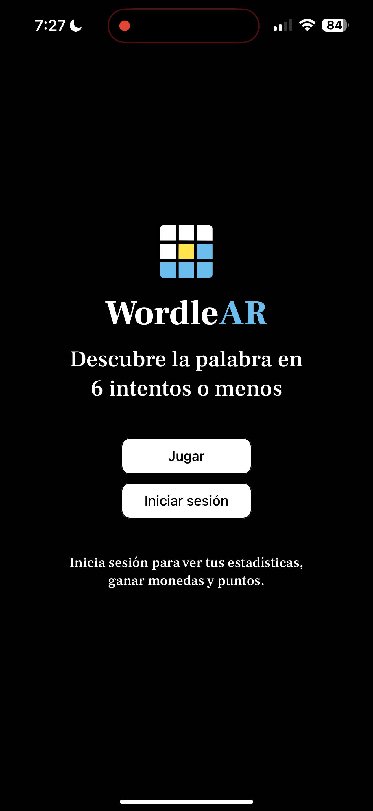

### Juego (Sesión cerrada)

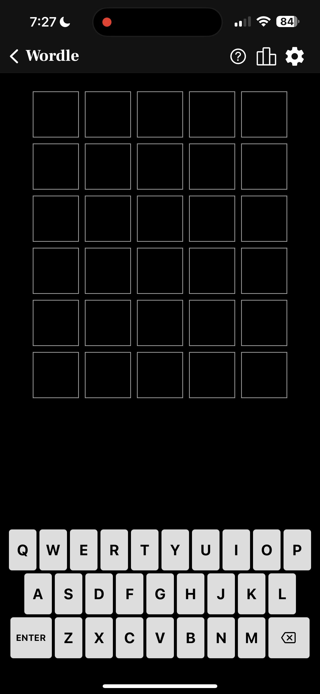

### Cómo jugar

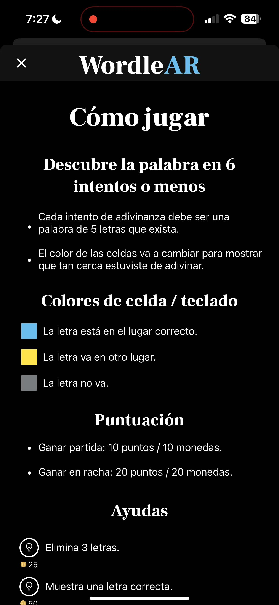

### Jugando (Sesión cerrada)

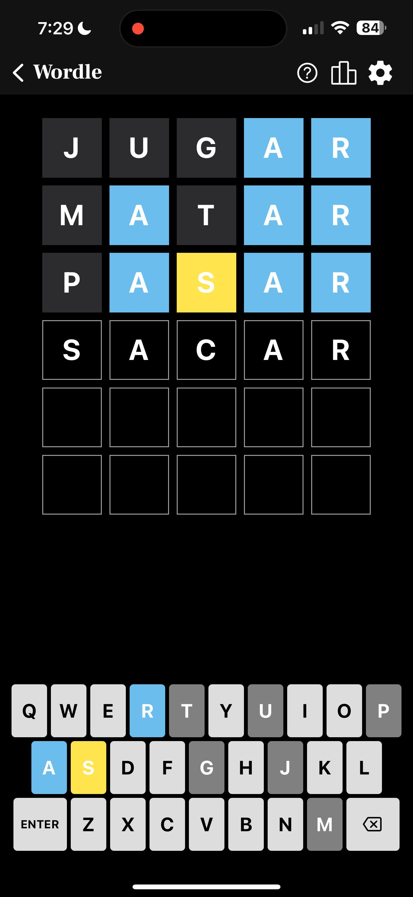

### Partida ganada (Sesión cerrada)

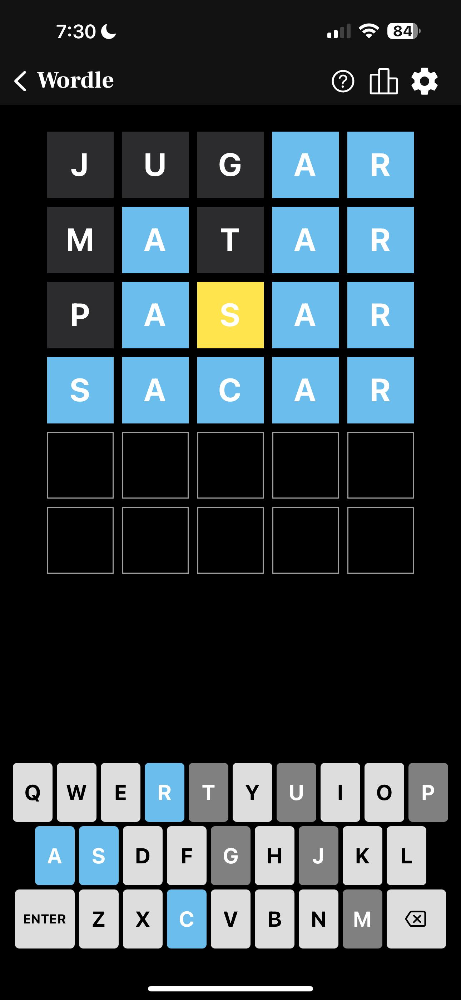

### Fin del juego (Sesión cerrada)


### Inicio de sesión

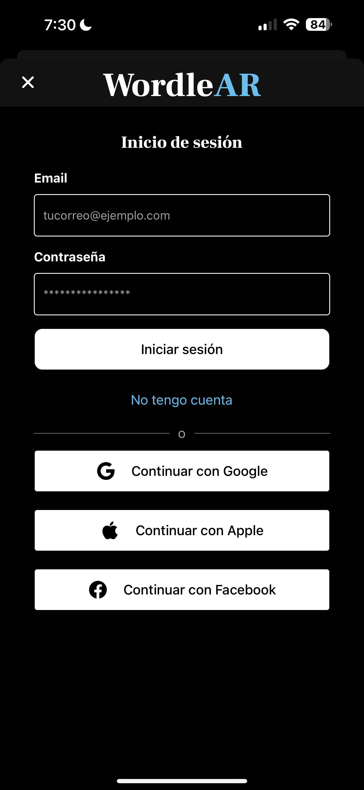

### Registrarse

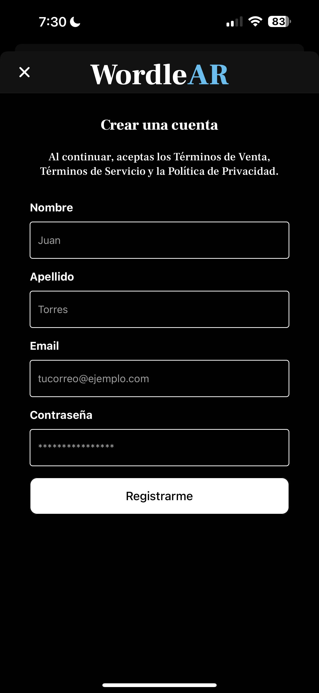

### Verificación de mail

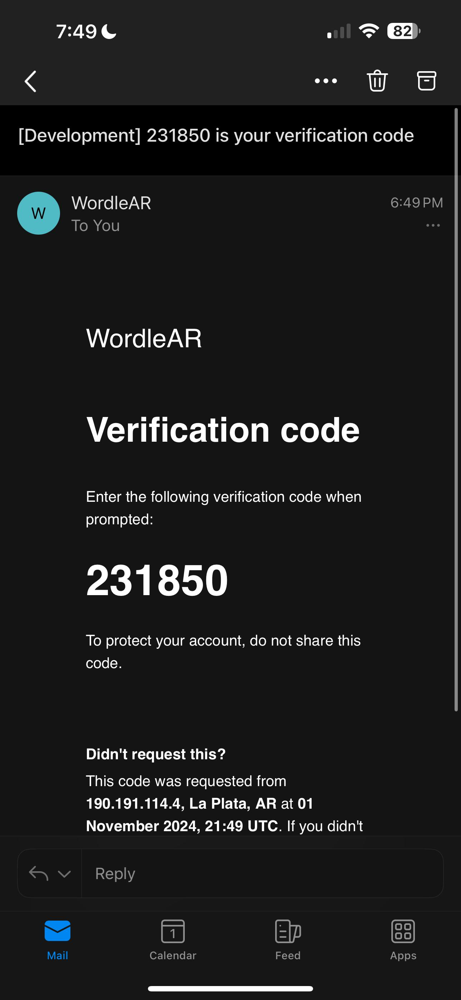

### Inicio (Sesión abierta)

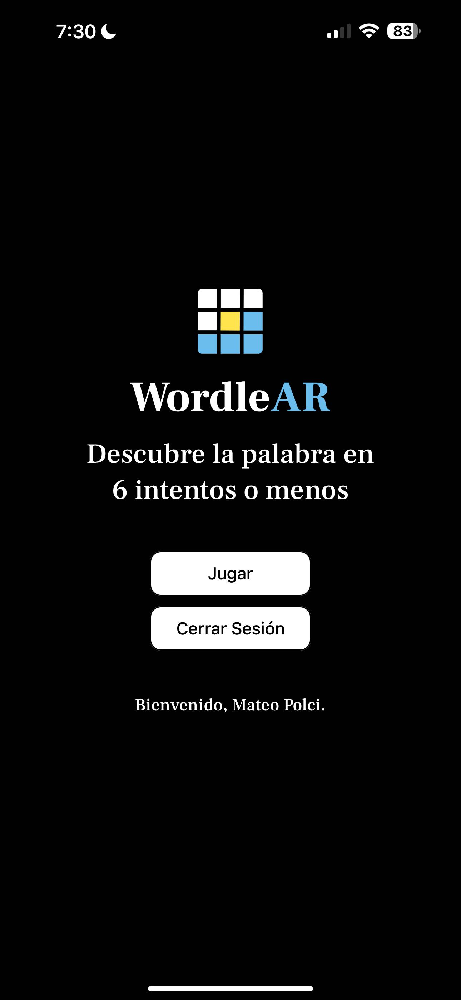

### Jugando (Sesión abierta)

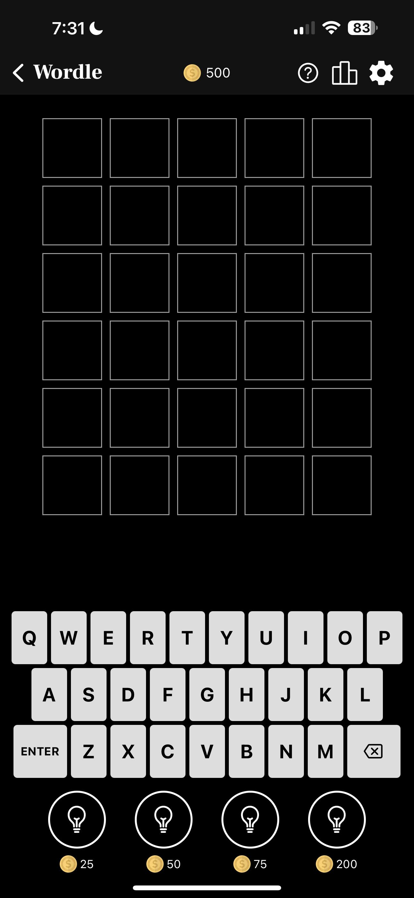

### Jugando con pistas (Sesión abierta)

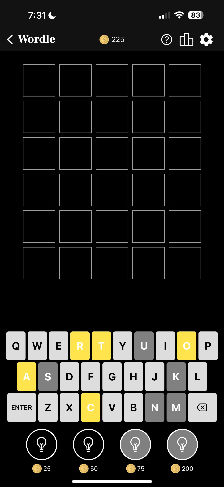

### Fin del juego (Sesión abierta)

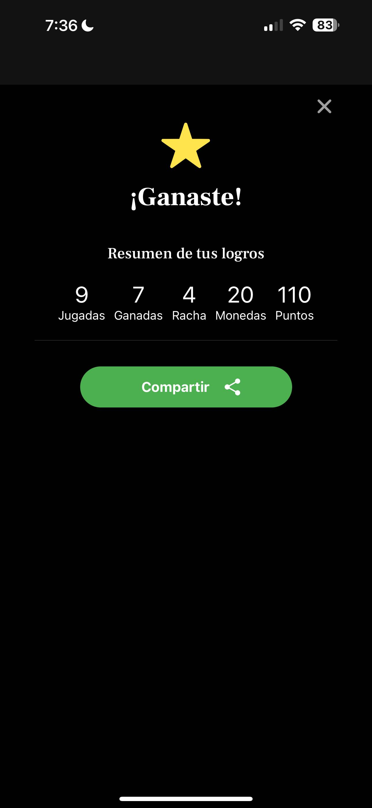

### Compartir partida

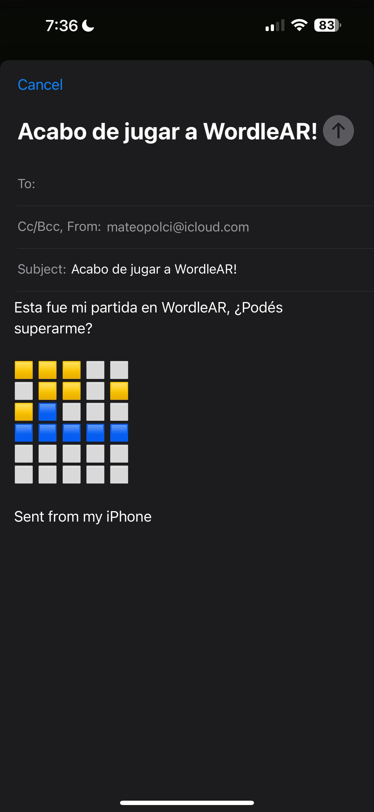

### Tabla de posiciones

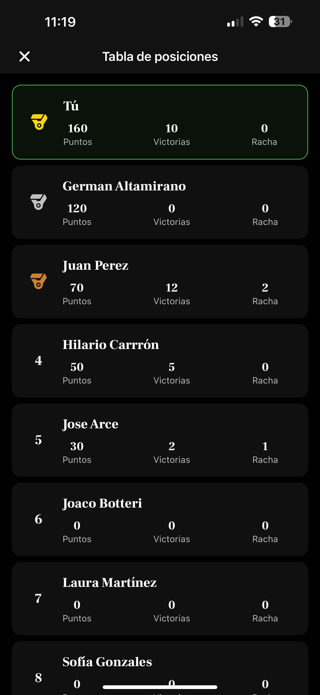
